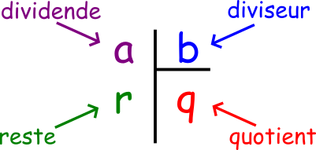

# Initiation au langage PYTHON 1 : Manipuler les nombres

Les documents suivants sont construits de telle manière à ce que vous observiez des exemples simples commentés puis que vous réalisiez les exercices proposés au fur et à mesure.
Il est important de tester vous même les petits morceaux de code proposés dans les exemples avant de passer aux exercices

## Calculer avec Python

Dans cette introduction, vous utiliserez Python en mode interactif via la zone __Shell__ du logiciel Thonny. 

Cette zone permet de tester du code sans avoir à la sauvegarder au préalable.  


Une invite de commande aussi appelée __prompt__ et symbolisée par 3 chevrons `>>>` vous permet de tester directement du code qui sera immédiatement interprété après l'appui sur la touche `entrée`

### Les types de base

L'instruction __type__ permet d'obteir le type d'un objet.
Dans le shell, tester les types des différents objets suivants :


```python
	type(8)
	type(-5)
	type(8.0)
	type(-5.4)
	type('Bonjour !')
	type(True)
```


Quels sont les différentes valeurs possibles pour un booléen ? (voir <https://fr.wikibooks.org/wiki/Programmation_Python/Bool%C3%A9ens>)


Compléter le tableau suivant avec les exemples précédemment faits :

| Exemple | type | nom |
|---------|------|-----|
|		  |		 | entiers (integer) |
|		  |		 | flottants |
|		  |		 | Chaine de cractères (string) |
|		  |		 | Booléen |


### Les nombres entiers

Effectuer, via le shell, les calculs suivants et compléter au fur et à mesure le tableau ci-dessous :

``` python
60 - 7
2 * 3 + 4
(-2 + 3) * 7 - 1
6 / 3
1 / 3
2 ** 2
2 ** 3
2 ** 4
10 // 3
11 // 3
12 // 3
13 // 3
14 // 3
10 % 3
11 % 3
12 % 3
13 % 3
14 % 3
2 < 7
2 < 2
5 >= 5
2 ** 3 ** 2
3 / 1 / 3
```

| Opérateur | Fonction | Type de l'objet obtenu |
|---------|------|-----|
| a ** b | 		 |
| a // b | 		|
| a % b | |
| a < b | |

En Python, les priorités opératoires sont-elles respectées : Oui / Non

En Python, la taille des entiers est limitée : Oui / Non




### Les flottants (ou nombres à virgule flottante)


Les nombres à virgule flottante sont des nombres comportant une partie entière et une partie décimale après la virgule  marquée par un point (notation anglo-saxonne).  

Entrez


```python
351.4 ** 6
```
Lorsque la partie entière d'un nombre flottant devient trop grande ou que le nombre commence par une grande suite de zéros (y compris la partie entière) : le nombre est donnée en notation scientifique (comme sur vos calculatrices).  
Ici __e__ signifie _"fois dix puissance "_ :   $\times10^{n}$.


```python
15.1 ** -8
```

On peut d'ailleurs directement écrire les nombres flottants sous cette forme :


```python
6.02e21
```

_Valeur exacte ou approximation ?_

Entrez :

```python
0.20000000000000000000000458
0.00000000002458652541255612
0.000000000024586525412556124654564564564564545645
```

Attention donc : la valeur retournée (et donc éventuellement stockée) par Python peut être une approximation du réel entré.


Enfin, il est intéressant de noter que Python convertit implicitement les entiers en flottants si nécessaire :


```python
4 + 5.2
```

__Remarque :__ chaque opérateur existe sous forme d'une fonction (cf. documentation officielle : Correspondance entre opérateurs et fonctions <https://docs.python.org/fr/3.7/library/operator.html?highlight=op%C3%A9rateurs%20affectation#mapping-operators-to-functions>)


__ mettre ici paragraphe sur valeur max et min possible avant infini

### Chaines de caractères et opérations

Testez dans le shell les opérations suivantes :

```python
'abc' + 'def'
'abc' * 2
'abc' ** 3
'abc' / 2
'abc' // 2 
```

L'opérateur + appliqué à deux chaines de caractères réalise leur __concaténation__ .


### Changer le type d'un objet


_Sources_

[^1]: image division euclidienne  https://www.jeuxmaths.fr
